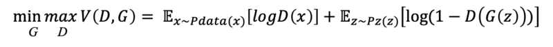
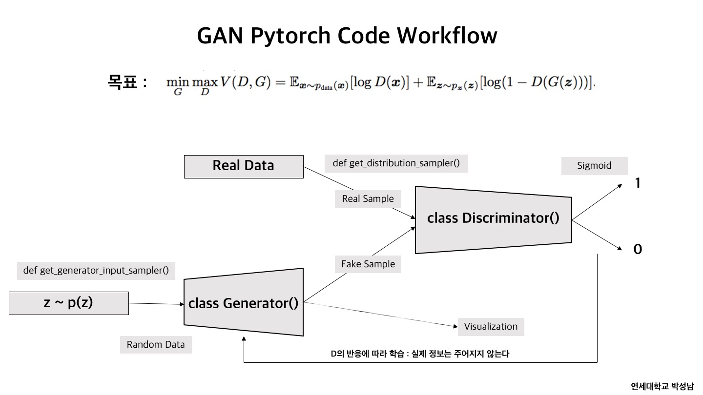
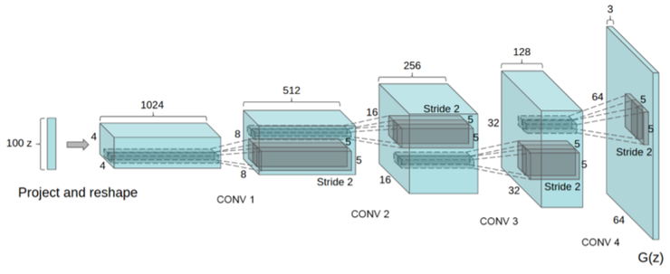

# GAN

>We propose a new framework for estimating generative models via an adversar-ial process, in which we simultaneously train two models: a generative model G that captures the data distribution, and a discriminative model D that estimates the probability that a sample came from the training data rather than G. The train-ing procedure for G is to maximize the probability of D making a mistake. This framework corresponds to a minimax two-player game. In the space of arbitrary functions G and D, a unique solution exists, with G recovering the training data distribution and D equal to 1/2 everywhere. In the case where G and D are defined by multilayer perceptrons, the entire system can be trained with backpropagation. There is no need for any Markov chains or unrolled approximate inference net-works during either training or generation of samples. Experiments demonstrate the potential of the framework through qualitative and quantitative evaluation of the generated samples.   
<GAN 논문 Abstract>

위의 말을 대충 요약하자면 적대적 프로세스(adversarial process)를 통해 새로운 프레임워크를 만들었다고 한다. 그 방법은 두 모델을 동시에 학습을 시키는 것인데 G라는 모델은 데이터 분포를 분석하여 진짜같은 가짜를 만드는 것이다. D라는 모델은 training data에서 G가 만들어낸 데이터들과 비교하여 나올 확률을 추정한다. G의 목표는 D의 실수를 최대화하는 것이다. 그래서 G가 만들어낸 것을 D가 1/2의 확률로 분별할때 까지는 하는 것이다.

수식은 다음과 같다.

> 

V(D,G)는 GAN의 loss함수 혹은 objective 함수이다. D의 목표는 이 함수가 최대가 되도록 하는 것이고, G의 목표는 이 함수가 최소가 되게 하는 것이다.

x는 실제 이미지 데이터이며, G(z)는 z를 이용하여 만들어낸 이미지 데이터이다. 

따라서 D는 D(G(z))가 최대한 0이 되게 하는 것이고, G는 그 반대로 최대한 1이 되게 하는 것이다.

이때 z가 생성된 원리는 랜덤 백터 벡터인데 이 값은 균등 분포(Uniform Distribution)나 정규 분포(Normal Distribution)에서 무작위로 추출된 값이며, G는 이 z를 이용하여 이미지를 만들어낸다.

---

# DCGAN

GAN의 한계점

1. GAN은 결과가 불안정하다.   
기존 GAN만 가지고는 좋은 성능이 잘 안나왔다.

2. Black-box method   
Neural Network 자체의 한계라고 볼 수 있는데, 결정 변수나 주요 변수를 알 수 있는 다수의 머신러닝 기법들과 달리 Neural Network은 처음부터 끝까지 어떤 형태로 그러한 결과가 나오게 되었는지 그 과정을 알 수 없다.

3. Generative Model 평가   
GAN은 결과물 자체가 새롭게 만들어진 Sample 이다. 이를 기존 sample과 비교하여 얼마나 비슷한 지 확인할 수 있는 정량적 척도가 없고, 사람이 판단하더라도 이는 주관적 기준이기 때문에 얼마나 정확한지, 혹은 뛰어난지 판단하기 힘들다.

>In recent years, supervised learning with convolutional networks (CNNs) has seen huge adoption in computer vision applications. Comparatively, unsupervised learning with CNNs has received less attention. In this work we hope to help bridge the gap between the success of CNNs for supervised learning and unsuper-vised learning. We introduce a class of CNNs called deep convolutional generative adversarial networks (DCGANs), that have certain architectural constraints, and demonstrate that they are a strong candidate for unsupervised learning. Training on various image datasets, we show convincing evidence that our deep convolu-tional adversarial pair learns a hierarchy of representations from object parts to scenes in both the generator and discriminator. Additionally, we use the learned features for novel tasks - demonstrating their applicability as general image repre-sentations.   
<DCGAN 논문 Abstract>

정말 정말 단순하게 말하면 GAN에 CNN을 적용했다는 말이 되겠다. 하지만 단순하게 CNN을 적용하면 되는건 아니다. 최적화하기 위해 다음과 같은 5가지 방법을 적용했다고 한다.(논문안에 있는 내용)

Architecture guidelines for stable Deep Convolutional GANs
- Replace any pooling layers with strided convolutions (discriminator) and fractional-strided
convolutions (generator).
- Use batchnorm in both the generator and the discriminator.
- Remove fully connected hidden layers for deeper architectures.
- Use ReLU activation in generator for all layers except for the output, which uses Tanh.
- Use LeakyReLU activation in the discriminator for all layers.
---
- Max-pooling layer를 없애고, strided convolution(D)이나 fractional-strided convolution(G)을 사용하여 feature-map의 크기를 조절한다.
- Batch normalization을 적용한다.
- Fully connected hidden layer를 제거한다.
- Generator의 출력단의 활성화 함수로 Tanh을 사용하고, 나머지 layer는 ReLU를 사용한다.
- Discriminator의 활성함수로 LeakyReLU를 사용한다.

generator model의 구조는 다음과 같다.

~~더 이상 이해가 안되요 ㅜㅠ~~