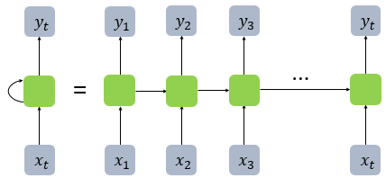

# RNN(Recurrent Neural Network)

다양한 길이의 입력 시퀸스를 처리할 수 있는 인공신경망 중 자연어처리에 대표적으로 사용된다.

다음은 RNN의 구조이다.   
RNN은 활성화 함수를 거친 결과값을 다시한번 계산할 수 있게 입력층으로 보낸다는 것이 특이점이라고 볼 수 있다. 




input 값은  one-hot 벡터를 사용한다. one-hot 벡터는 언어들의 상관 관계는 알 수 없다. 단지 어떤 언어가 빈번하게 있는지 알기 위해서 사용된다. 예를 들면 c같은 경우 알파벳이 26자이므로 총 배열의 길이는 26자가 될것이고 다음과 같이 표현할 수 있다.   
[0,0,1,0,..,0]

RNN의 실행 코드는 다음과 같다.

```py
import torch.nn as nn

class RNN(nn.Module):
    def __init__(self, input_size, hidden_size, output_size):
        super(RNN, self).__init__()

        self.hidden_size = hidden_size

        self.i2h = nn.Linear(input_size + hidden_size, hidden_size)
        self.i2o = nn.Linear(input_size + hidden_size, output_size)
        self.softmax = nn.LogSoftmax(dim=1)

    def forward(self, input, hidden):
        combined = torch.cat((input, hidden), 1)
        hidden = self.i2h(combined)
        output = self.i2o(combined)
        output = self.softmax(output)
        return output, hidden

    def initHidden(self):
        return torch.zeros(1, self.hidden_size)

n_hidden = 128
rnn = RNN(n_letters, n_hidden, n_categories)
```

위 코드에서 확인 할 수 있듯이 return값이 2개인것을 확인 할 수 있다. 처음 hidden의 벡터는 0으로 초기화 해준다.

```py
input = lineToTensor('Albert')
hidden = torch.zeros(1, n_hidden)

output, next_hidden = rnn(input[0], hidden)
print(output)
```
위의 코드는 다음의 과정에서 위의 코드까지 나오기 전까지 셋팅이 되어있다는 가정하에 output을 확인해 보겠다.
>https://tutorials.pytorch.kr/intermediate/char_rnn_classification_tutorial.html

```py
tensor([[-2.8646, -2.9245, -2.9756, -2.9451, -2.7820, -3.0002,-2.8055, -2.8977,-2.8573, -2.8691, -3.0234, -2.9436, -2.9146, -2.8814, -2.7751, -2.9309,-2.8228, -2.8563]],grad_fn=<LogSoftmaxBackward>)
```

카테고리가 총 18개인것을 생각하고 보면 위와 같은 결과는 총 18개의 카테고리 중 어떤 카테고리에 더 알맞은 지 확률을 나타내준다. 더 높을 수록 확률이 높다. 

이제 학습을 통해 가중치를 조절해보자.
```py
learning_rate = 0.005

def train(category_tensor, line_tensor):
    hidden = rnn.initHidden()

    rnn.zero_grad()

    for i in range(line_tensor.size()[0]):
        output, hidden = rnn(line_tensor[i], hidden)

    loss = criterion(output, category_tensor)
    loss.backward()

    # 매개변수의 경사도에 학습률을 곱해서 그 매개변수의 값에 더합니다.
    for p in rnn.parameters():
        p.data.add_(p.grad.data, alpha=-learning_rate)

    return output, loss.item()
```

이렇게 실행하고 나서 다음과 같이 학습 결과를 확인 해보자

```py
def predict(input_line, n_predictions=3):
    print('\n> %s' % input_line)
    with torch.no_grad():
        output = evaluate(lineToTensor(input_line))

        # Get top N categories
        topv, topi = output.topk(n_predictions, 1, True)
        predictions = []

        for i in range(n_predictions):
            value = topv[0][i].item()
            category_index = topi[0][i].item()
            print('(%.2f) %s' % (value, all_categories[category_index]))
            predictions.append([value, all_categories[category_index]])

predict('Sanghoon')
```

```
> Sanghoon
(-0.62) Korean
(-1.70) English
(-2.58) Scottish
```

