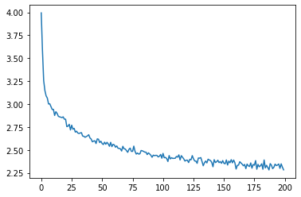

# RNN

저번 RNN은 이름이 어느 나라에 분류될지 예측하는 모델이었다면, 이번 모델은 나라를 입력하면 그 나라에 해당하는 이름을 생성하는 모델이다.

초기 구성은 이전 RNN모델과 비슷하다. 데이터들을 리스트에 저장을 해둔다. 그리고 그 데이터를 one-hot 벡터로 바꿔서 입력이 들어가게 될것이다.

그리고 다음은 이번 모델의 구조이다. 이전과 다른 점은 인자가 하나가 더 늘었다는 점과 더 나은 성능을 위해서 output과 hidden을 결합하여 020거친 뒤 dropout과 softmax를 적용했다는 점이다.


위의 도식을 코딩으로 나타낸 것이다. 마찬가지로 def forword에서 이전 RNN모델과 다르게 category인자가 하나 추가 된것을 확인 할 수 있다. 그렇기 때문에 입력 사이즈도 category개수 만큼 커지는 것을 알 수 있고, categoty에 분류된 문자중에서 나올 확률이 가장 높은 문자가 다음 입력으로 들어가게 된다.

```py
import torch
import torch.nn as nn

class RNN(nn.Module):
    def __init__(self, input_size, hidden_size, output_size):
        super(RNN, self).__init__()
        self.hidden_size = hidden_size

        self.i2h = nn.Linear(n_categories + input_size + hidden_size, hidden_size)
        self.i2o = nn.Linear(n_categories + input_size + hidden_size, output_size)
        self.o2o = nn.Linear(hidden_size + output_size, output_size)
        self.dropout = nn.Dropout(0.1)
        self.softmax = nn.LogSoftmax(dim=1)

    def forward(self, category, input, hidden):
        input_combined = torch.cat((category, input, hidden), 1)
        hidden = self.i2h(input_combined)
        output = self.i2o(input_combined)
        output_combined = torch.cat((hidden, output), 1)
        output = self.o2o(output_combined)
        output = self.dropout(output)
        output = self.softmax(output)
        return output, hidden

    def initHidden(self):
        return torch.zeros(1, self.hidden_size)
```

다음의 링크에서 one-hot 벡터로 바꾸는 과정과 초기 변수 설정은 참고하자.

>https://tutorials.pytorch.kr/intermediate/char_rnn_generation_tutorial.html


다음은 학습을 하는 부분이다. 이때 모든 단계에서 예측을 수행하기 때문에 마찬가지로 모든 단계에서 손실을 계산하고 합쳐야한다. 모든 과정은 autograd가 잘해준다.

```py
criterion = nn.NLLLoss()

learning_rate = 0.0005

def train(category_tensor, input_line_tensor, target_line_tensor):
    target_line_tensor.unsqueeze_(-1)
    hidden = rnn.initHidden()

    rnn.zero_grad()

    loss = 0

    for i in range(input_line_tensor.size(0)):
        output, hidden = rnn(category_tensor, input_line_tensor[i], hidden)
        l = criterion(output, target_line_tensor[i])
        loss += l

    loss.backward()

    for p in rnn.parameters():
        p.data.add_(p.grad.data, alpha=-learning_rate)

    return output, loss.item() / input_line_tensor.size(0)
```
다음은 학습이 진행 될수록 손실율이 감소하는 것을 도식화 한것이다.




다음은 학습된 모델을 이용하여 sample을 얻는 과정이다.

```py
max_length = 20

# Sample from a category and starting letter
def sample(category, start_letter='A'):
    with torch.no_grad():  # no need to track history in sampling
        category_tensor = categoryTensor(category)
        input = inputTensor(start_letter)
        hidden = rnn.initHidden()

        output_name = start_letter

        for i in range(max_length):
            output, hidden = rnn(category_tensor, input[0], hidden)
            topv, topi = output.topk(1)
            topi = topi[0][0]
            if topi == n_letters - 1:
                break
            else:
                letter = all_letters[topi]
                output_name += letter
            input = inputTensor(letter)

        return output_name

# Get multiple samples from one category and multiple starting letters
def samples(category, start_letters='ABC'):
    for start_letter in start_letters:
        print(sample(category, start_letter))

samples('Korean', 'abc')
```

위의 결과는 다음과 같다.

```
an
bon
chon
```

좀 이상하다. 그래서 Korean의 데이터를 확인해보았다.

<details>
<summary>Korean.txt</summary>

Ahn Baik Bang Byon Cha Chang Chi Chin Cho Choe Choi Chong Chou Chu Chun Chung Chweh Gil Gu Gwang Ha Han Ho Hong Hung Hwang Hyun 
Jang
Jeon
Jeong
Jo
Jon
Jong
Jung 
Kang
Kim
Ko
Koo
Ku
Kwak
Kwang 
Lee
Li
Lim 
Ma
Mo
Moon
Nam
Ngai
Noh
Oh 
Pae
Pak
Park 
Ra
Rhee
Rheem
Ri
Rim
Ron
Ryom
Ryoo
Ryu
San
Seo
Seok
Shim
Shin
Shon
Si
Sin
So
Son
Song
Sook
Suh
Suk
Sun
Sung
Tsai 
Wang
Woo
Yang
Yeo
Yeon
Yi
Yim
Yoo
Yoon
You
Youj
Youn
Yu
Yun

</details>

확인을 해보면 좀 특이한 성들도 많이 나열이 되어있다. 또한 이것을 보았을 때 가장 있을 법한 즉, 한국에서 가장 많이 분포해 있는 성으로 출력은 힘들 것 같다. 하나의 한계점을 발견한 것 같다.