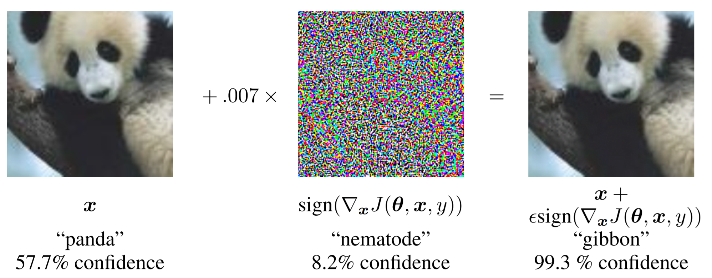
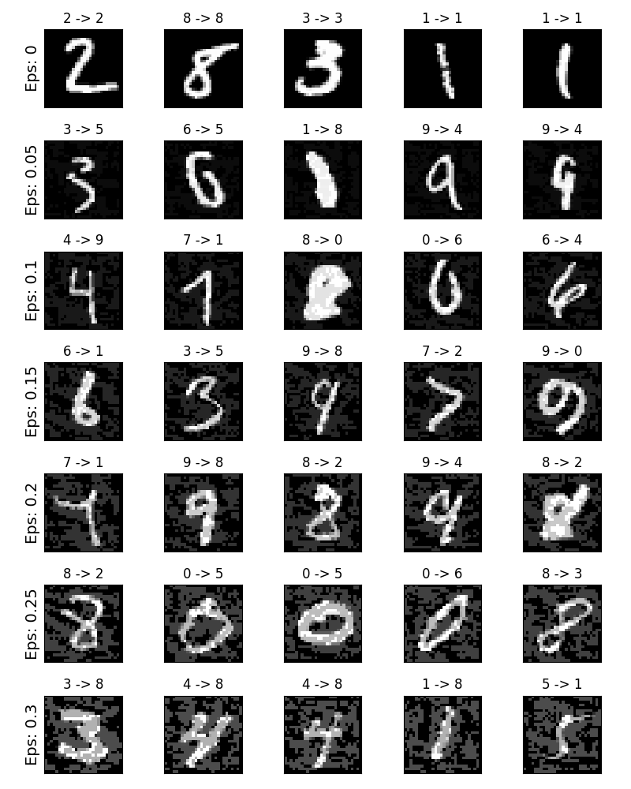

# ADVERSARIAL EXAMPLE GENERATION

>Adversarial example : Original input에 매우 작은 noise를 더하여 사람의 눈에는 차이가 없어 보이나 분류기는 잘못 분류 하도록 변형된 input

다음사진을 보면 처음 판다의 사진은 원본 사진이다. 이때 분류기는 판다라고 잘 분류를 한다. 하지만 판다사진에 noise를 더하면 분류기는 무려 99.3의 신뢰도로 긴팔원숭이라고 분류를 하게 된다. 

마지막 사진은 우리 눈으로 보기에는 아무런 차이가 없어 보인다. 그만큼 작은 noise가 오류를 불러온다.



이러한 Adversarial example을 만드는 것을 adversarial attack이라 하고, 이를 방어하는 것은 defense against adversarial attack 이라 한다.

Adversarial attack은 다음과 같이 구분할 수 있다.

- White-box attack : 공격자가 모델의 아키텍처, 입력, 출력, 가중치 등의 parameters를 알고 있는 상황

- Black-box attack : 공격자가 모델의 parameters를 모르는 상황
---
- Targeted attack : Adversarial example이 공격자가 원하는 class로 오분류 하도록 공격하는 방식

- Untargeted attack : Adversarial example이 true class가 아닌 어떠한 class로 오분류 하도록 공격하는 방식

만약 실생활에서 자율자동차로 예를 들면 전방을 인식을 하게 될때 오분류가 일어나면 최악의 상황이 발생할 수도 있다는 것이다. 그러니 이를 예방하기 위해 다양한 방법을 사용해야한다.

다음은 Adversarial example을 만드는 방식이다.


```py
from __future__ import print_function
import torch
import torch.nn as nn
import torch.nn.functional as F
import torch.optim as optim
from torchvision import datasets, transforms
import numpy as np
import matplotlib.pyplot as plt

#epsilons - 실행에 사용할 엡실론의 리스트입니다. 엡실론 0의 값은 원래 테스트 셋의 모델 성능을 나타내므로 목록에 유지하는 것이 중요합니다. 또한 직관적으로 엡실론이 클수록 작은 변화가 더 눈에 띄지만 모델 정확도를 저하 시키는 측면에서 더 효과가 있습니다. 여기서 데이터의 범위는 0-1 이기 때문에 엡실론의 값은 1을 초과할 수 없습니다.

#pretrained_model - pytorch/examples/mnist를 통해 미리 학습된 MNIST 모델의 경로. 

#use_cuda - CUDA 를 사용할지 말지 정하는 이진 플래그.
epsilons = [0, .05, .1, .15, .2, .25, .3]
pretrained_model = "data/lenet_mnist_model.pth"
use_cuda=True

# LeNet 모델 정의
class Net(nn.Module):
    def __init__(self):
        super(Net, self).__init__()
        self.conv1 = nn.Conv2d(1, 10, kernel_size=5)
        self.conv2 = nn.Conv2d(10, 20, kernel_size=5)
        self.conv2_drop = nn.Dropout2d()
        self.fc1 = nn.Linear(320, 50)
        self.fc2 = nn.Linear(50, 10)

    def forward(self, x):
        x = F.relu(F.max_pool2d(self.conv1(x), 2))
        x = F.relu(F.max_pool2d(self.conv2_drop(self.conv2(x)), 2))
        x = x.view(-1, 320)
        x = F.relu(self.fc1(x))
        x = F.dropout(x, training=self.training)
        x = self.fc2(x)
        return F.log_softmax(x, dim=1)

# MNIST 테스트 데이터셋과 DateLoader 선언
test_loader = torch.utils.data.DataLoader(
    datasets.MNIST('../data', train=False, download=True, transform=transforms.Compose([
            transforms.ToTensor(),
            ])),
        batch_size=1, shuffle=True)

# 어떤 Device를 사용할지 정의
print("CUDA Available: ",torch.cuda.is_available())
device = torch.device("cuda" if (use_cuda and torch.cuda.is_available()) else "cpu")

# 모델 초기화
model = Net().to(device)

# pretrained된 모델 불러오기
model.load_state_dict(torch.load(pretrained_model, map_location='cpu'))

# 모델을 평가모드로 설정하기. Dropout 레이어들을 위해 사용된다.
model.eval()

#다음 함수의 3개의 인자로 첫번째는 원본 이미지 ( x ), 두번째는 엡실론 으로 픽셀 단위의 작은 변화를 주는 값입니다 ( ϵ ). 마지막은 data_grad 로 입력 영상 ( ∇xJ(θ,x,y) ) 에 대한 변화도 손실 값이다. 식은 다음과 같다.

#perturbed_image=image+epsilon∗sign(data_grad)=x+ϵ∗sign(∇xJ(θ,x,y))

# FGSM attack code
def fgsm_attack(image, epsilon, data_grad):
    # data_grad의 요소별 부호값을 얻어온다.
    sign_data_grad = data_grad.sign()
    # 입력 이미지의 각 픽셀에 sign_data_grad를 적용하여 noise가 적용된 이미지를 생성한다.
    perturbed_image = image + epsilon*sign_data_grad
    # 값의 범위를 [0,1]로 유지하기 위해 다음을 한다.
    perturbed_image = torch.clamp(perturbed_image, 0, 1)
    # noise가 적용된 이미지를 반환한다.
    return perturbed_image

def test( model, device, test_loader, epsilon ):

    # 정확도 카운터
    correct = 0
    adv_examples = []

    # 테스트 셋의 모든 예제에 대해 루프를 돕니다
    for data, target in test_loader:

        # 디바이스(CPU or GPU) 에 데이터와 라벨 값을 보냅니다
        data, target = data.to(device), target.to(device)

        # 텐서의 속성 중 requires_grad 를 설정합니다. 공격에서 중요한 부분입니다
        data.requires_grad = True

        # 데이터를 모델에 통과시킵니다
        output = model(data)
        init_pred = output.max(1, keepdim=True)[1] # 로그 확률의 최대값을 가지는 인덱스를 얻습니다

        # 만약 초기 예측이 틀리면, 공격하지 않도록 하고 계속 진행합니다
        if init_pred.item() != target.item():
            continue

        # 손실을 계산합니다
        loss = F.nll_loss(output, target)

        # 모델의 변화도들을 전부 0으로 설정합니다
        model.zero_grad()

        # 후방 전달을 통해 모델의 변화도를 계산합니다
        loss.backward()

        # 변화도 값을 모읍니다
        data_grad = data.grad.data

        # FGSM 공격을 호출합니다
        perturbed_data = fgsm_attack(data, epsilon, data_grad)

        # 작은 변화가 적용된 이미지에 대해 재분류합니다
        output = model(perturbed_data)

        # 올바른지 확인합니다
        final_pred = output.max(1, keepdim=True)[1] # 로그 확률의 최대값을 가지는 인덱스를 얻습니다
        if final_pred.item() == target.item():
            correct += 1
            # 0 엡실론 예제에 대해서 저장합니다
            if (epsilon == 0) and (len(adv_examples) < 5):
                adv_ex = perturbed_data.squeeze().detach().cpu().numpy()
                adv_examples.append( (init_pred.item(), final_pred.item(), adv_ex) )
        else:
            # 추후 시각화를 위하 다른 예제들을 저장합니다
            if len(adv_examples) < 5:
                adv_ex = perturbed_data.squeeze().detach().cpu().numpy()
                adv_examples.append( (init_pred.item(), final_pred.item(), adv_ex) )

    # 해당 엡실론에서의 최종 정확도를 계산합니다
    final_acc = correct/float(len(test_loader))
    print("Epsilon: {}\tTest Accuracy = {} / {} = {}".format(epsilon, correct, len(test_loader), final_acc))

    # 정확도와 적대적 예제를 리턴합니다
    return final_acc, adv_examples

#이제 다음의 입력을 통해서 앱실론 값의 변화에 따라(noise의 정도) 정확도가 달라지는 것을 확인하자.
accuracies = []
examples = []

# 각 엡실론에 대해 테스트 함수를 실행합니다
for eps in epsilons:
    acc, ex = test(model, device, test_loader, eps)
    accuracies.append(acc)
    examples.append(ex)

#output
#Epsilon: 0      Test Accuracy = 9810 / 10000 = 0.981
#Epsilon: 0.05   Test Accuracy = 9426 / 10000 = 0.9426
#Epsilon: 0.1    Test Accuracy = 8510 / 10000 = 0.851
#Epsilon: 0.15   Test Accuracy = 6826 / 10000 = 0.6826
#Epsilon: 0.2    Test Accuracy = 4301 / 10000 = 0.4301
#Epsilon: 0.25   Test Accuracy = 2082 / 10000 = 0.2082
#Epsilon: 0.3    Test Accuracy = 869 / 10000 = 0.0869
```
다음은 결과를 이미지로 만들어 저장한 것이다. 모델은 오분류를 하였지만 사람의 눈으로는 정확히 구분할 수 있다.

